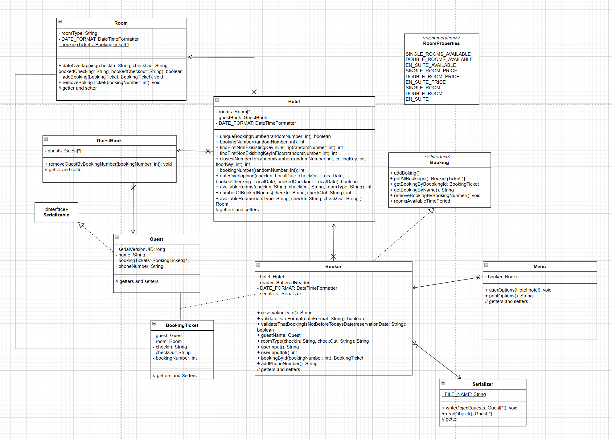

Hotel Booking Application

Overview

A proof-of-concept application for managing hotel room bookings using an object-oriented programming (OOP) approach. The application is currently console-based but is structured to allow future enhancements with a JavaFX GUI framework.

Features

The application provides the following functionalities:

Book a Room: Allows users to book a specific room in the hotel.

Remove Booking: Enables users to cancel an existing booking.

Hotel Management: Supports managing a hotel with various room types.

Find Available Rooms: Allows users to search for rooms that are available for booking.

Serialization and Deserialization: Ensures data persistence by saving and loading the application state.

Technical Requirements

The application is guaranteed to run with the following configuration:

Java Version: 22

JavaFX Framework: Used for structuring the application, with potential for GUI integration in future versions.

The application's design adheres to the principles of OOP and is visually represented by the UML class diagram below: